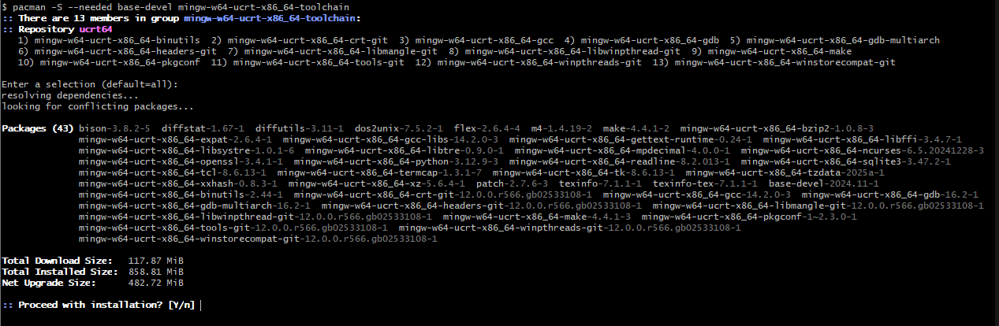

C/C++ Sandbox <!-- omit in toc -->
-------------

This is a sandbox repository with code snippets written in either C or C++.

---

Table of Contents<!-- omit in toc -->
-----------------
- [Configuring MinGW](#configuring-mingw)
- [Building the Projects](#building-the-projects)
- [Debugging in Visual Studio Code](#debugging-in-visual-studio-code)
- [Data Structures in C](#data-structures-in-c)
- [Design Patterns in C](#design-patterns-in-c)

---

## Configuring MinGW

You need to download, install  MSYS2 and then download the UCRT toolchain as described in [Configuring MinGW in VSCode](https://code.visualstudio.com/docs/cpp/config-mingw).



> :warning: Add the toolchain path to your Windows account environment variables and not to your .bashrc. Not all terminals inherit your .bashrc and the paths within.

Additionally, append (after ucrt) `C:\msys64\mingw64\bin` to the path; it has the make tool we will need to build.

Restart vscode (or just the integrated terminal) and type `which gcc`, you should see `/c/msys64/ucrt64/bin/gcc`

## Building the Projects
1. Create a build folder under each algorithm's root directory
   `mkdir build`
2. Open a bash shell at the root directory and run
    `cmake -S . -B build`
3. This is generating a MSVS project for me. You can instead change the generator to minGW (assuming you already donwloaded it)
   `cmake -G "MinGW Makefiles" -S . -B build`


   > :memo: Use the `-DCMAKE_BUILD_TYPE=Debug` option to build an executable that you can debug with
   > `cmake -G "MinGW Makefiles" -DCMAKE_BUILD_TYPE=Debug -S . -B build`

   > :memo: You can use the 'clean' option to clear out the cmake files in a project
   > `cmake --build build --target clean`

4. cd to the build directory and then run make to build the target executable.
   `cd build; make`

## Debugging in Visual Studio Code
1. Create a launch.json file for the workspace in the "Run and Debug" panel.
2. Choose "C++ (GDB/LLDB)"
3. Select the ""(gdb) Launch"" option


4. Modify `program` to point to the executable you wish to debug
```
"program": "${workspaceRoot}\\c\\design_patterns\\subclassing_with_queue\\build\\subclassing_with_queue.exe",
```

5. You have to tell it where to find gdb, modify the path. For example,


```
"miDebuggerPath": "C:\\msys64\\mingw64\\bin\\gdb.exe",
```

6. Go back to the "Run and Debug" panel and launch your configuration


7. I have created two such configurations
   1. "Debug (gdb) with CMake and Build": Run cmake on the chosen folder, build the executable and then debug it
   2. "Debug (gdb) with Build": Build the executable and debug it

    > :memo: In both cases a drop-down menu appears with the choice of the program to build and run. You have to select it twice in succession as there is an issue with passing variables from launch.json to tasks.json

    > :memo: Both builds are built with debug symbols enabled. For production, remove `CMAKE_BUILD_TYPE=Debug` from the cmake task in tasks.json

8. Set a breakpoint in code and run either of these configurations to debug.

---

## Data Structures in C

[Click to view link...](c/data_structures/README.md)

---

## Design Patterns in C

[Click to view link...](c/design_patterns/README.md)

---
