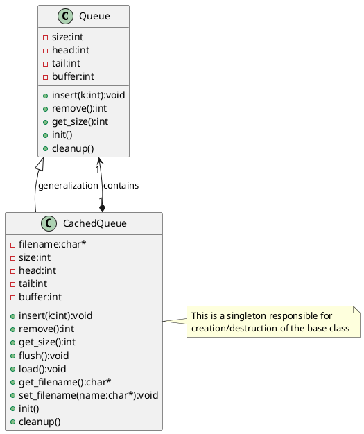

SubClassing
-----------

```plantuml
@startuml
class Queue {
    -size:int
    -head:int
    -tail:int
    -buffer:int
    +insert(k:int):void
    +remove():int
    +get_size():int
    +init()
    +cleanup()
}

class CachedQueue {
    -filename:char*
    -size:int
    -head:int
    -tail:int
    -buffer:int
    +insert(k:int):void
    +remove():int
    +get_size():int
    +flush():void
    +load():void
    +get_filename():char*
    +set_filename(name:char*):void
    +init()
    +cleanup()
}

Queue <|-- CachedQueue: generalization
Queue "1" <--* "1" CachedQueue: contains
note right of CachedQueue
This is a singleton responsible for
creation/destruction of the base class
end note

@enduml
```
